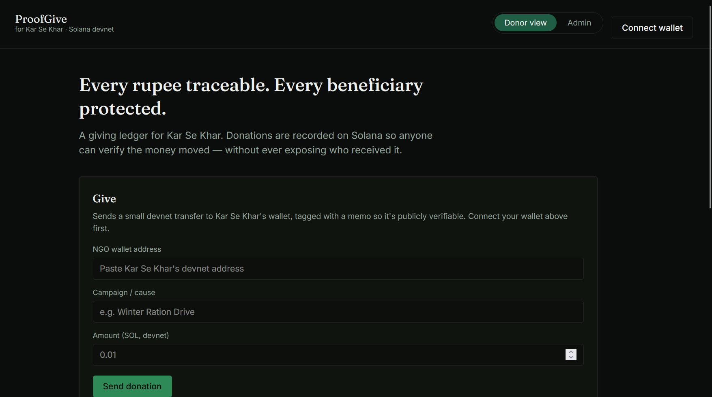
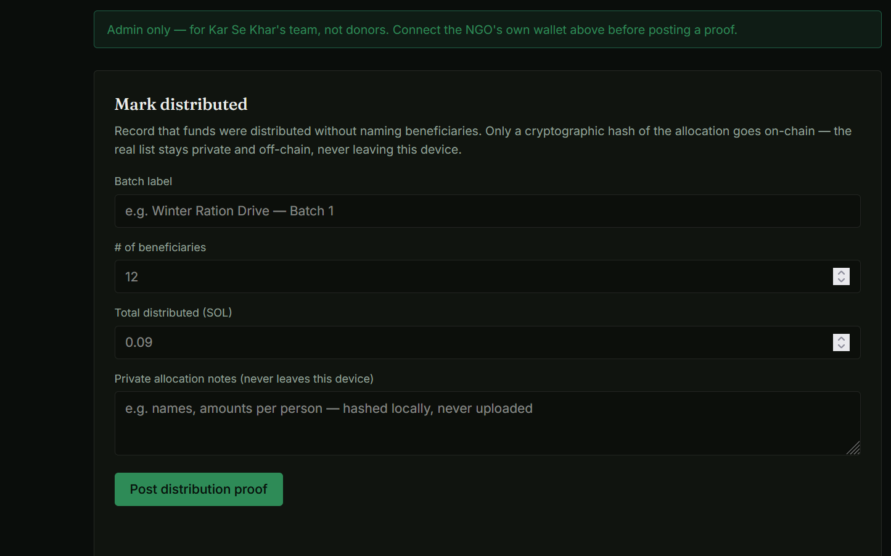
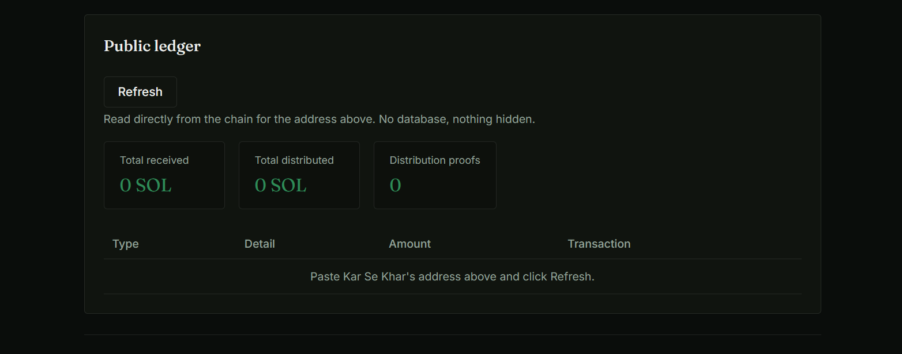

# ProofGive

A transparent, privacy-preserving donation ledger built on Solana for **Kar Se Khar**, for DEV's Weekend Challenge: Generosity Edition.

## The problem

Donors rarely know if their money reaches the people it was meant for. NGOs, in turn, often can't prove fair distribution without publishing personal details about vulnerable beneficiaries — which trades one harm for another.

## The idea

ProofGive keeps two things public and one thing private:

- **Public:** every donation, and every "distribution proof" (a batch label, beneficiary count, and total amount), all on Solana devnet, viewable by anyone.
- **Private:** who the actual beneficiaries are and how much each one got. That detail is hashed (SHA-256) locally in the browser before anything is sent on-chain — only the hash is public, so the NGO can later prove a specific allocation matches the hash without ever uploading names or amounts per person.

## Two views

### Donor view
Connect a wallet, send a donation, and watch the public ledger update straight from the chain.



### Admin view
Click "Admin" in the header and enter the passcode (`karsekhar-admin` — change this in `app.js` before sharing the repo). This is where Kar Se Khar's team posts a distribution proof using the NGO's own connected wallet.



The passcode is a demo-level separation, not real security — visible to anyone reading the source. Good enough to show the intended roles for the challenge; a production version would need real authentication.

### Public ledger
Read real-time totals and transaction proofs verified straight from Solana devnet.



## Running it locally

1. Install the [Phantom wallet](https://phantom.app) browser extension and switch its network to **Devnet**.
2. Get devnet SOL for your wallet from the [Solana faucet](https://faucet.solana.com).
3. Serve this folder with any static server:
   ```bash
   npx serve .
